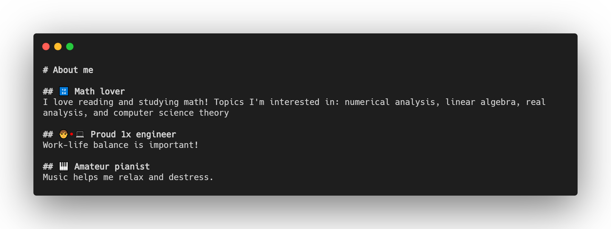

## Hi there 👋

I'm Garrett, a computer science student at UC San Diego, and currently
a fellow at Major League Hacking. Programming is something I'm passionate about,
and I just love coding and learning whatever I can.

## Links

- [LinkedIn](https://www.linkedin.com/in/garrettluu/)
- [Facebook](https://www.facebook.com/garrettluu/)
- [Personal Website](https://garrettluu.com/)

<!--
**garrettluu/garrettluu** is a ✨ _special_ ✨ repository because its `README.md` (this file) appears on your GitHub profile.

Here are some ideas to get you started:

- 🔭 I’m currently working on ...
- 🌱 I’m currently learning ...
- 👯 I’m looking to collaborate on ...
- 🤔 I’m looking for help with ...
- 💬 Ask me about ...
- 📫 How to reach me: ...
- 😄 Pronouns: ...
- ⚡ Fun fact: ...
-->
